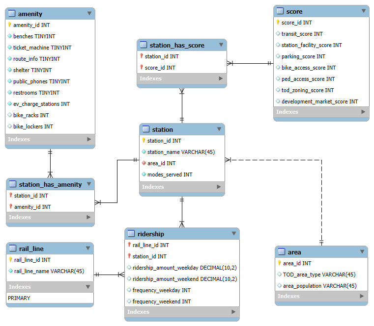

# Full Report: MTA Transit-Oriented Development Analysis

This report explores transit accessibility and infrastructure equity across Maryland using SQL and the MTA TOD dataset.

## Project Focus

The aim is to analyze how TOD affects accessibility across urban, suburban, and rural areas. By using relational modeling and SQL queries, the project identifies disparities and suggests areas for improvement in transit planning.

## Database Design
Below is the logical design used for the transit database:

## Analysis Highlights

### Stations with Highest to Lowest Accessibility Scores
Urban stations like Union Station and Penn Station scored a perfect 5.0 for accessibility, thanks to excellent pedestrian and bike infrastructure. In contrast, stations like Harpers Ferry and Jessup scored as low as 1.0, often located in areas with limited non-car access.

### High Pedestrian, Low Bike Access
Some stations had great walkability (pedestrian scores of 4.0 or higher) but lacked bike support (bike scores of 3.0 or lower). This shows uneven investment, with sidewalks prioritized over bike lanes and racks.

### TOD Area Analysis
- **Downtowns**: Best overall access for walking and biking, limited parking (deliberate transit-first design)
- **Urban Neighborhoods**: Balanced scores across access types, slightly more car-friendly
- **Suburban/Town Centers**: Most stations but poor bike/ped scores, pointing to car-heavy infrastructure
This reveals a need to boost non-car options in suburban TOD zones

This suggests that if equity and sustainable transit are priorities, planning efforts should focus on improving walkability and bike access in suburban and rural TOD zones. They should also be considering non-car infrastructure as part of future suburban transit expansion.

### Station Consistency in Ridership
Stations with steady ridership throughout the week tend to be near homes or community spaces. Inconsistent stations are mostly used on weekdays, often near office areas or schools, suggest the potential to increase weekend transit use.

### Amenity Diversity vs. Ridership
Stations with more types of amenities had a slightly positive correlation between amenity diversity and weekday ridership and a moderate negative correlation with weekend ridership. This suggests that stations with more diverse amenities do not necessarily attract more weekend riders and may even slightly correlate with lower weekend use, possibly because high-amenity stations are in less recreational or more commuter-heavy areas. 

## Lessons Learned

- Improved SQL skills in joins, aggregation, and views
- Cleaned and standardized data with NULL handling
- Navigated challenges with grouped queries and schema consistency

## Future Work

- Integrate demographic datasets for deeper equity analysis
- Use community feedback for accessibility scoring
- Model TOD impact on affordability and infrastructure

## Data Source

[MTA Transit Oriented Development (TOD) Data](https://opendata.maryland.gov/Transportation/MTA-Transit-Oriented-Development-TOD-Data/cqt2-ypem/about_data)
